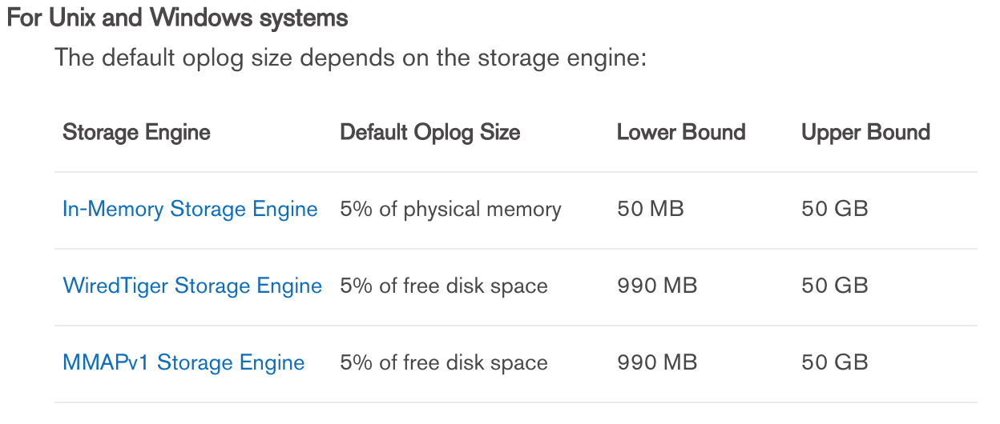

Oplog

# overvivew

1. oplog在第一次开启复制集时生成，存放在local.oplog.rs，是一个capped collection

2. oplog可以从任何一个复制集的数据节点复制

3. oplog中的操作的都是幂等的

# oplog size

1. 在mongod创建oplog前，通过oplogSizeMB参数设定oplog size

2. 复制集开启后，通过replSetResizeOplog命令动态设置oplog size而不用重启mongod

3. 在某些情况下，需要设置大的oplog size:
    
    1. 一次更新多个文档

    为了幂等性，oplog 需要转换multi-updates成单个操作，需要使用较多的oplog size 空间

    2. 插入数量和删除数量相同

    删除数量和插入数量相同，数据库不会有较大的磁盘开销，但是oplog会较大

    3. 文档内字段更新后，文档大小不变，数据库会记录大量的操作，但此时数据库数据存储大小基本不变

# oplog status

1. rs.printReplicationInfo()查看oplog status

2. 在从节点执行db.getReplicationInfo()查看是否oplog同步落后